<!-- TOC -->

- [Linux-0.11](#linux-011)
      - [gitignore git忽略文件](#gitignore-git忽略文件)
      - [忽略文件](#忽略文件)
  - [调试 Linux 最早期的代码](#调试-linux-最早期的代码)
    - [整体思路和效果](#整体思路和效果)
    - [第一步：配置虚拟机](#第一步配置虚拟机)
      - [Oracle VM VirtualBox Version 6.0.8 Edition](#oracle-vm-virtualbox-version-608-edition)
      - [ubuntu-16.04.7-desktop-amd64](#ubuntu-16047-desktop-amd64)
    - [第二步：安装 qemu](#第二步安装-qemu)
    - [第三步：下载并运行可调试的 Linux 0.11 源码](#第三步下载并运行可调试的-linux-011-源码)
    - [第四步：通过 vscode 远程调试](#第四步通过-vscode-远程调试)
  - [自制os极简教程2：史上最难的 hello world](#自制os极简教程2史上最难的-hello-world)
    - [三个前置知识和四次跳跃](#三个前置知识和四次跳跃)
    - [bochs 虚拟机](#bochs-虚拟机)
      - [第一步：新建一个文件 boot.s](#第一步新建一个文件-boots)
      - [第二步：编译它](#第二步编译它)
      - [第三步：创建虚拟磁盘映像，并填充第一扇区](#第三步创建虚拟磁盘映像并填充第一扇区)
      - [第四步：用 bochs 启动它](#第四步用-bochs-启动它)
      - [总结流程图](#总结流程图)
      - [尾声](#尾声)
- [正式启动](#正式启动)

<!-- /TOC -->

# Linux-0.11

git clone git@github.com:wgf8088/Linux-0.11.git

git@github.com:wgf8088/Linux-0.11.git

https://github.com/wgf8088/Linux-0.11.git


echo "# Linux-0.11" >> README.md
git init
git add README.md
git commit -m "first commit"
git branch -M main
git remote add origin https://github.com/wgf8088/Linux-0.11.git
git push -u origin main


git remote add origin https://github.com/wgf8088/Linux-0.11.git
git branch -M main
git push -u origin main


#### gitignore git忽略文件

github 官网 搜索 gitignore 可以找到 各个语言的默认忽略文件配置,以供拷贝使用
https://github.com/github/gitignore

```cpp
vim .gitignore

*.h     //*通配符,所有的.h文件
!a.h    //取反,管理 a.h 排除在外 除外
b.h

.gitignore
files/          //  忽略files文件夹
*.py[c|a|d]     //  排除 pyc , pya , pyd 后缀的文件

```


#### 忽略文件
• 有些文件不必提交到版本库中
    – 可执行文件、日志文件、临时文件、库文件
• 忽略文件模式：glob模式匹配
    – 忽略以#开始的行
    – 忽略某种格式结尾文件：*.[ao] 
    – 某个库文件除外，不忽略：！clib.a
    – 忽略临时文件：*~
    – 忽略根目录下的某个文件：/text
    – 忽略某个目录下的所有文件：libs/、libs/*.a
    *.o *.a = *.[ao]
• 手动创建.gitignore文件
```sh{.line-numbers}
# vim .gitignore
*.bin
*.[ao]
！clib.a
*~
#/debug

```

## 调试 Linux 最早期的代码

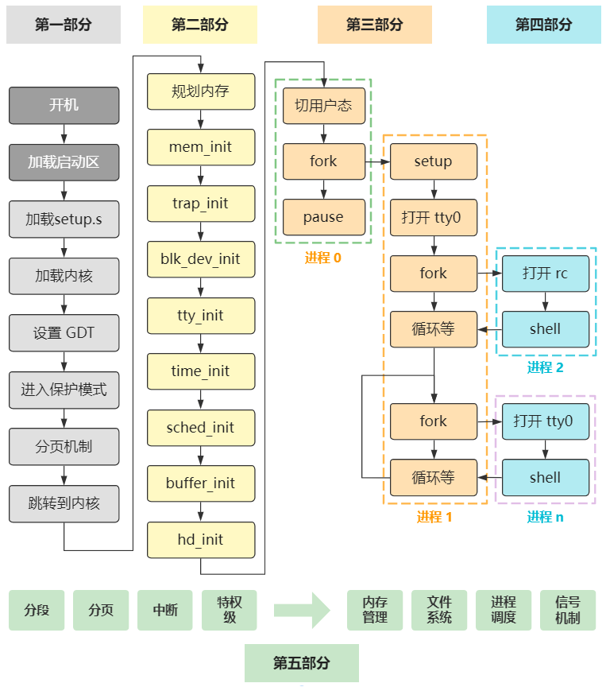

先照着这个文档，使得可以用 gdb 进行调试：
https://wenfh2020.com/2021/05/19/gdb-kernel-networking/

再按照这个文档，用 vscode 进行更直观地调试（当然也是 gdb 方式）：
https://wenfh2020.com/2021/06/23/vscode-gdb-debug-linux-kernel/

最终效果是。
虚拟机这边用 qemu 启动 Linux 5.0.1 内核。
本机这边用 vscode 的 ssh-remote 插件远程连接虚拟机，然后用 gdb debug。


Linux 0.11 是 Linux 最早期的代码，非常适合作为第一款深入探索操作系统原理的代码。

但同时，Linux 0.11 因为很多古老工具链的缺失，以及一些过时的文件格式比如 a.out，导致成功编译并运行它十分困难，更别说进行源码级别的 debug 调试了。

要想成功调试 Linux 0.11，需要进行很多改造，并依赖一些古老的工具链，对于仅仅是将 Linux 0.11 作为研究操作系统的手段的我们，无需花费精力自己去改造它，踩各种坑。

所以今天我就分享一下我调试 Linux 0.11 的一种方式，同时也为了我自己以后换电脑的时候方便照着自己的教程直接无脑搭建环境，那我们开始吧~

### 整体思路和效果

我用的方式是，在 windows 上，搞一个 Ubuntu 16.04 的虚拟机，在里面用 qemu 启动一个开启了调试的 Linux 0.11 系统，然后用本机的 vscode remote ssh 连接到虚拟机，并开启 gdb 调试，最终的效果如下。
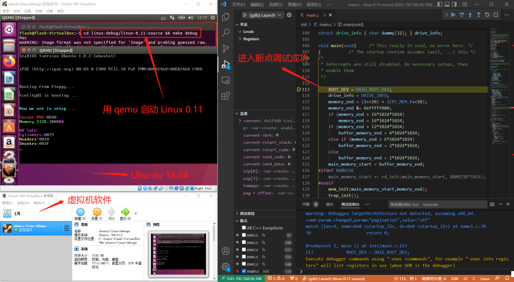

这是最舒服的方式，因为 vscode 是本机的，完全不受虚拟机的影响，这也是我调试其他代码时比较喜欢的方式。

如果你有自己的豪华服务器，虚拟机也可以换成服务器，这样不但编译速度快，不消耗自己电脑的性能，同时也可以不受终端的影响，在家在公司都可以随时调试（方便摸鱼~）

当然如果你不需要这么直观 vscode 这一步也可以换成 gdb 命令行，在虚拟机里直接执行 gdb 相关命令即可。
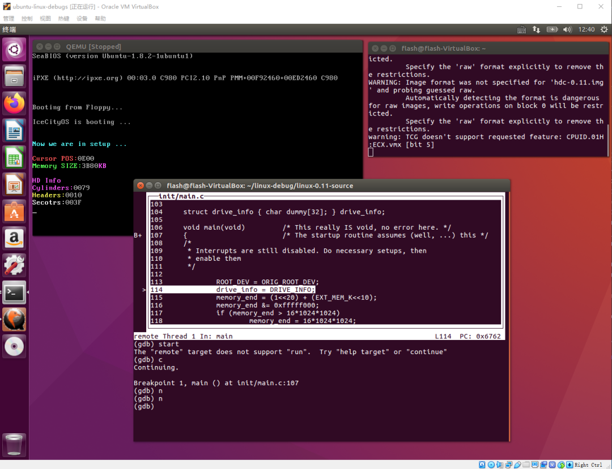

下面我们就一步步来实现这个效果。

### 第一步：配置虚拟机

我用的虚拟机软件是
#### Oracle VM VirtualBox Version 6.0.8 Edition

官网是：
https://ubuntu.com/

下载页面是：
https://www.virtualbox.org/wiki/Download_Old_Builds_6_0

我这个版本的直接下载地址是：
https://download.virtualbox.org/virtualbox/6.0.8/VirtualBox-6.0.8-130520-Win.exe

安装的操作系统镜像是
#### ubuntu-16.04.7-desktop-amd64

官网是：
https://ubuntu.com/

下载页面是：
https://releases.ubuntu.com/xenial/

我这个版本的直接下载地址是：
https://releases.ubuntu.com/xenial/ubuntu-16.04.7-desktop-amd64.iso

这个就不详细展开讲解了，最终达到这个效果就行。
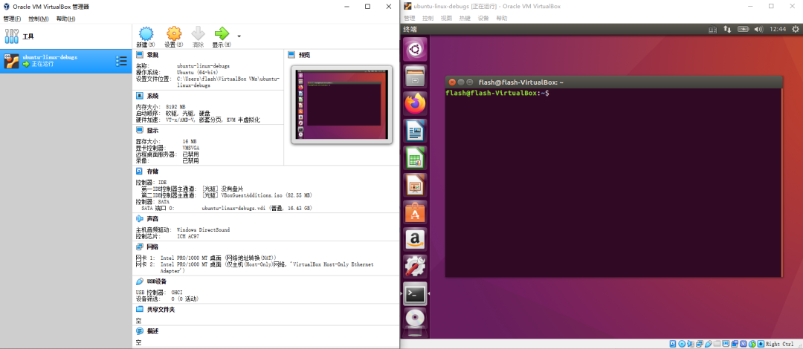

### 第二步：安装 qemu

qemu 是模拟器，简单理解和虚拟机一样，用来当做真机启动 Linux 0.11 的。

官网是这个：
https://www.qemu.org/

我们在刚刚的 Ubuntu 虚拟机里直接按照官方教程下载 qemu
```c{.line-numbers}
sudo apt-get install qemu
```

下载好后，我们输入 qemu-，按两下 tab，查看下支持的体系结构。
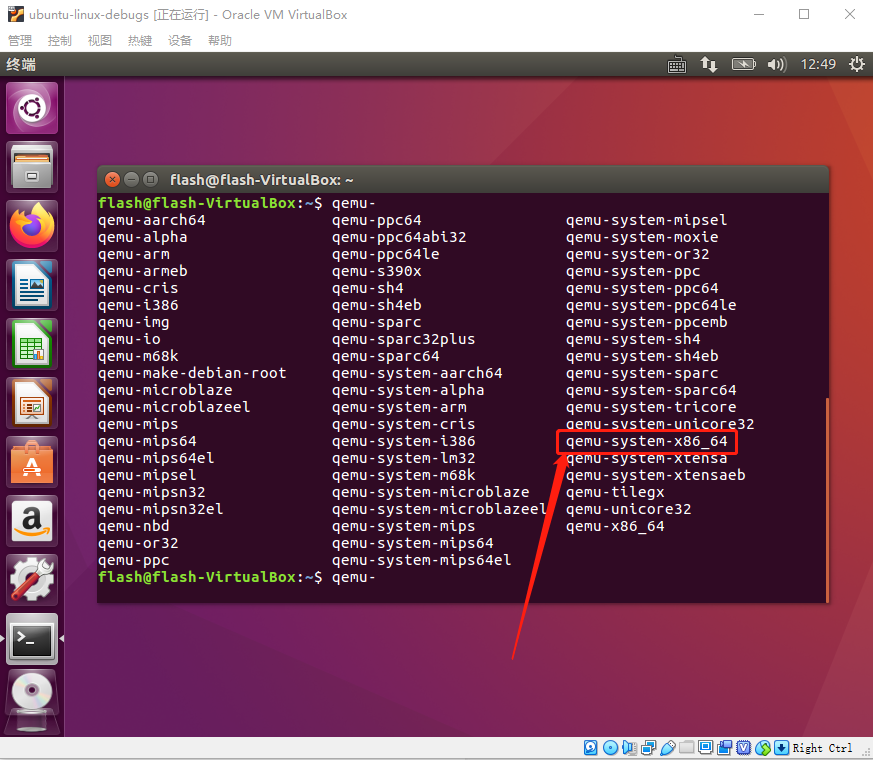

看到有 qemu-system-x86_64 即可，一会我们会用这个来模拟启动 Linux 0.11。

### 第三步：下载并运行可调试的 Linux 0.11 源码

这一步直接下官网上的是不行的，因为那个依赖好多古老的工具链。

这里一般网上都是参考了赵炯老师为我们修改好的 Linux 0.11 源码，用现代的工具链即可构建，造福了广大热爱内核的开发者，我们直接拿来主义即可。

在赵炯老师准备好的源码的基础上，很多人又进行了二次改造，使得其可以一键 qemu 或 bochs 启动，这里我选择了仓库：
https://github.com/yuan-xy/Linux-0.11

直接把源码下载下来，进入根目录，输入命令 make start 就可以把 Linux 0.11 跑起来了。
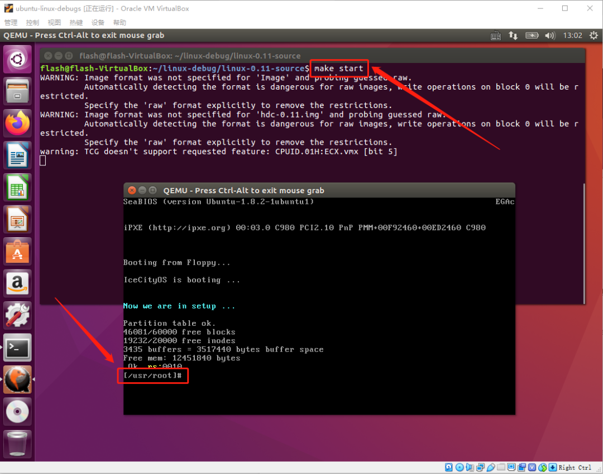

如果想 debug，那么就以 debug 形式启动，输入命令 make debug，它会卡住不动。
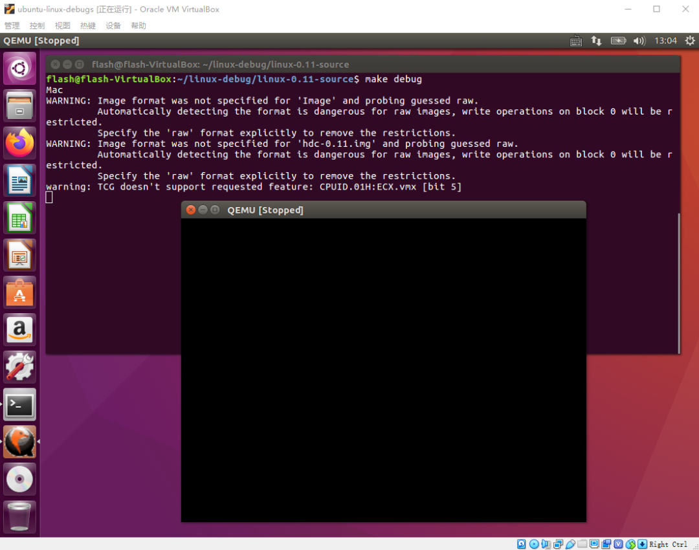

此时其实你就可以通过 gdb 进行调试了。

再开一个窗口，输入命令 gdb tools/system

然后 target remote :1234

就可以愉快地进行 gdb 调试了


具体 gdb 怎么玩，就不展开讲解了。

### 第四步：通过 vscode 远程调试

当然，你也可以在虚拟机里用 vscode 进行本地调试，但我觉得不爽。

所以，在本机的 windows 里安装好 vscode，下载 remote-ssh 插件。
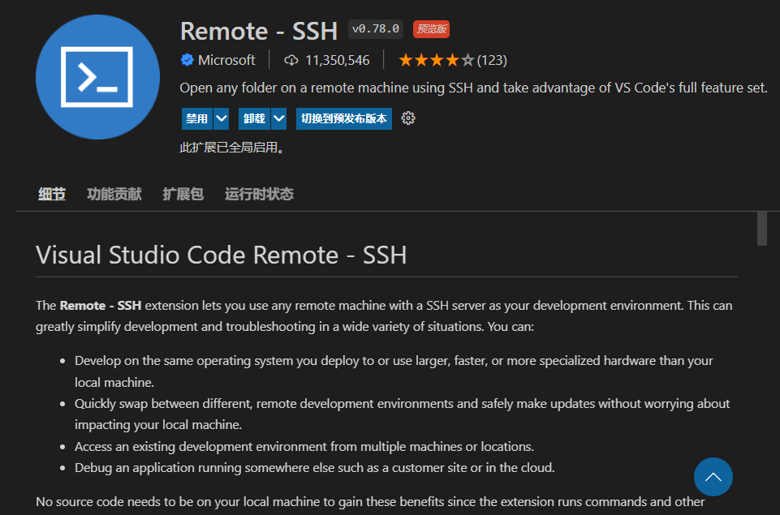

下载好后按下 ctrl + p，输入 >remote-ssh，找到 Connect to Host
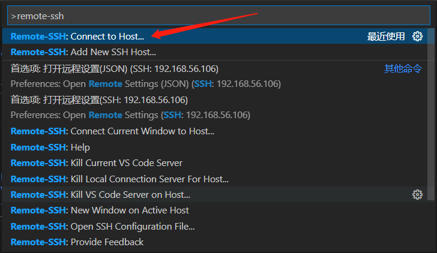

按照它提示的格式输入你的虚拟机 IP 和用户名，随后输入密码，即可远程连接到虚拟机。

之后点击菜单栏 运行-启用调试，在弹出的 launch.json 中做如下配置
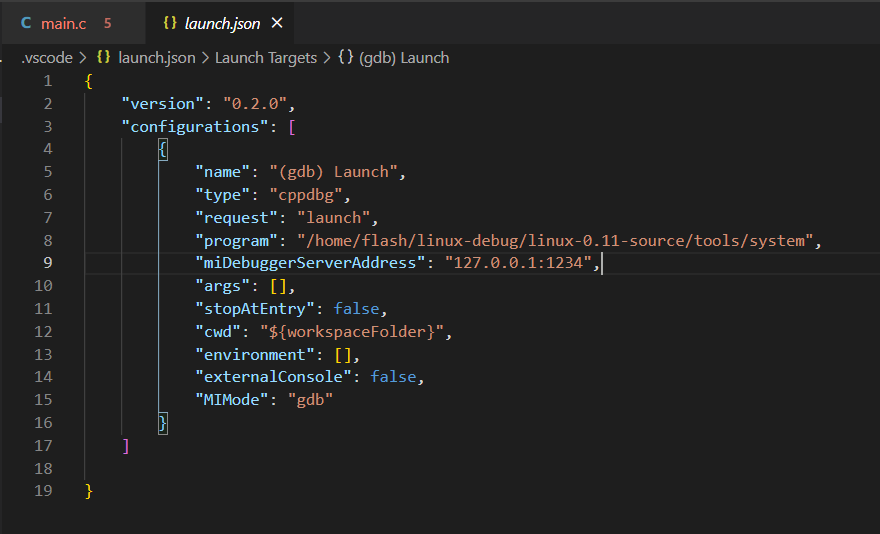

```c{.line-numbers}
{
    "version": "0.2.0",
    "configurations": [
        {
            "name": "(gdb) Launch",
            "type": "cppdbg",
            "request": "launch",
            "program": "${workspaceFolder}/tools/system",
            "miDebuggerServerAddress": "127.0.0.1:1234",
            "args": [],
            "stopAtEntry": false,
            "cwd": "${workspaceFolder}",
            "environment": [],
            "externalConsole": false,
            "MIMode": "gdb"
        }
    ]
}
```
配置好后保存，在 main 函数里打个断点，再次点击菜单栏 运行-启用调试，可以发现调试成功。


当然，记得每次 vscode 调试前，在虚拟机里先把 Linux 0.11 跑起来，就是执行命令 make debug。

这一步也可以配置到 vscode 里，但这一步没多少工作量，而且也不方便直观看到虚拟机里的行为，我就懒得弄了。

好了，这个教程到这里就结束了，这就是我调试 Linux 0.11 的其中一个办法，当然每个人可能都有自己喜欢的方式，只要适合自己就好。


## 自制os极简教程2：史上最难的 hello world

### 三个前置知识和四次跳跃

首先说下三个前置知识，这些必须假设你是知道的，否则我不可能从质子中子原子开始讲起。这三个前置知识就是：
1. 内存是存储数据的地方，给出一个地址信号，内存可以返回该地址所对应的数据。
2. CPU 的工作方式就是不断从内存中取出指令，并执行。
3. CPU 从内存的哪个地址取出指令，是由一个寄存器中的值决定的，这个值会不断进行 +1（抽象意义的） 操作，或者由某条跳转指令指定其值是多少。

有这三个前置知识后，接下来就是要记住计算机开机后的四次关键跳跃，因为这些都是当时 Intel 和 BIOS 等制作厂商的大叔们定下来的，没什么道理可言，记住就好：
1. 按下开机键，CPU 将 PC 寄存器的值强制初始化为 0xffff0，这个位置是 BIOS 程序的入口地址（一跳）
2. 该入口地址处是一个跳转指令，跳转到 0xfe05b 位置，开始执行（二跳）
3. 执行了一些硬件检测工作后，最后一步将启动区内容加载（复制）到内存 0x7c00，并跳转到这里（三跳）
4. 启动区代码主要是加载操作系统内核，并跳转到加载处（四跳）

前三跳，都是 CPU 硬件以及 BIOS 写死的一段代码搞定的，不用我们管，你也千万不要去管它，否则你就再也到不了 hello world 这一步了...

我们要实现的，就是启动区代码这个第四跳。启动区本来的作用是加载操作系统内核的，不过我们由于是 hello world 程序，我们就只让启动区代码实现一个向屏幕输出字符串的功能就好啦~

###  bochs 虚拟机
用 bochs 虚拟机代替真实的电脑，用无格式的虚拟硬盘文件代替真实的硬盘，用 dd 命令模仿烧录的过程。

#### 第一步：新建一个文件 boot.s

```s{.line-numbers}
;BIOS把启动区加载到内存的该位置
;所以需设置地址偏移量
section mbr vstart=0x7c00

;直接往显存中写数据
mov ax,0xb800 ;这条就是第一条指令
mov gs,ax
mov byte [gs:0x00],'h'
mov byte [gs:0x02],'e'
mov byte [gs:0x04],'l'
mov byte [gs:0x06],'l'
mov byte [gs:0x08],'o'
mov byte [gs:0x0a],' '
mov byte [gs:0x0c],'w'
mov byte [gs:0x0e],'o'
mov byte [gs:0x10],'r'
mov byte [gs:0x12],'l'
mov byte [gs:0x14],'d'

jmp $

;512字节的最后两字节是启动区标识
times 510-($-$$) db 0
db 0x55,0xaa
```

代码很好理解，主要有三部分
```s{.line-numbers}
开头：section mbr vstart=0x7c00

由于这个代码最终会被 BIOS 从硬盘的启动扇区加载到内存中的 0x7c00 位置，所以 section mbr vstart=0x7c00 就表示了这个偏移量，否则里面的变量地址呀、跳转地址呀，将会不正确。

结尾：db 0x55,0xaa

最后两个字节是 0x55 0xaa，是启动区的标志，不是这两个字节的话 BIOS 就不会把它当做启动区，仅仅就是硬盘的第一扇区而已，也就不会加载里面的内容。

中间：mov byte [gs:0x00],...

中间的代码就是最终看到效果的关键部分。启动流程中讲了实模式下的内存分布，知道 0xB8000 - 0xB8FFFF 这段内存空间是文本模式下显存的内存映射区域，往这个内存区域里写数据，就相当于往显卡的内存区域里写数据，也就相当于在屏幕上输出文本了。至于显卡是怎么把写到它内存上的数据转化成屏幕上的小亮点的，别问我，问我也不知道，如果你这块的好奇心大于代码，说明你适合做硬件工程师，嘿嘿~
```

#### 第二步：编译它
```s{.line-numbers}
nasm -o boot.bin boot.s
```
之前说好啦，不讲汇编知识，说不讲就一点也不讲，哈哈~

#### 第三步：创建虚拟磁盘映像，并填充第一扇区
用 bochs 自带的工具创建一个大小为 60M 的无格式的虚拟磁盘映像
```s{.line-numbers}
bximage -mode=create -hd=60 -q os.raw
```
将刚刚编译好的二进制文件 boot.bin 用 dd 命令写入磁盘第一扇区，就相当于将数据烧录进磁盘的过程。
```s{.line-numbers}
dd if=boot.bin of=os.raw bs=512 count=1
```
由于是无格式的虚拟硬盘文件，我们用二进制编辑器打开 os.raw，和我们编译出的 boot.bin 完全一样，就是下面这一串内容：

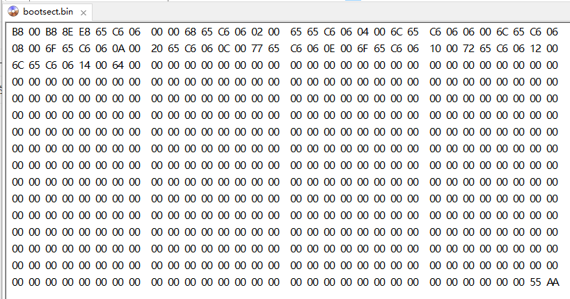

当然 boot.bin 只有 512 字节，而 os.raw 有 60M，但他们开头的前 512 字节都是一样的。注意看最后两个字节是 55 AA，这是我们代码中写入的，作为启动区标识。开头有很多非零的数据，这个就是编译后的机器码。中间的那些零，就什么都没有啦，因为既没有被编译的机器指令落在这个区域，又没有数据放在这个区域。

你当然可以不用通过写汇编代码、编译、再dd写入这种方式获得这个二进制文件，你也可以直接把这个二进制文件用键盘一位一位地敲出来。

而且如果你把这一段二进制数据，在现实中真真正正烧录进一块真实硬盘的第一扇区，并且把它插在一个电脑上，那当你按下开机键后，屏幕上就会出现 hello world 字符串。嗯就是这么简单粗暴。

现在我们有了一块烧录上了“操作系统”的虚拟硬盘文件 os.raw，也有了模拟电脑的虚拟机 bochs，接下里就插入硬盘、按下开机键就好啦～

#### 第四步：用 bochs 启动它
首先 bochs 配置文件 bochs.properties 中指定磁盘，则 bochs 虚拟机就可以读入这块虚拟磁盘文件了，就相当于在真机上把磁盘插进去。
```s{.line-numbers}
ata0-master: type=disk, path="os.raw", mode=flat, cylinders=121, heads=16, spt=63
```
然后用 bochs 命令启动虚拟机，就相当于按下了电脑开机键。
```s{.line-numbers}
bochs -f bochs.properties
```
于是就看到了下面的画面

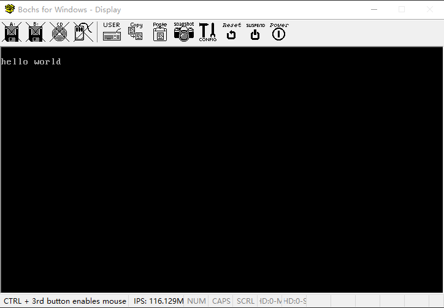

然后请自行脑补在真机上运行的画面

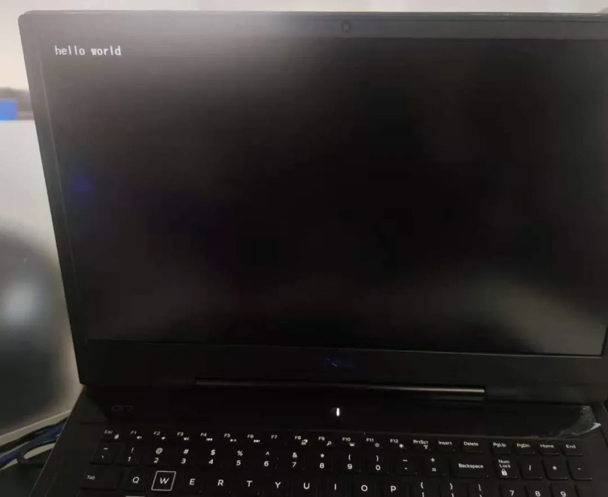

#### 总结流程图
之前的所有努力，下面一张图就搞定啦

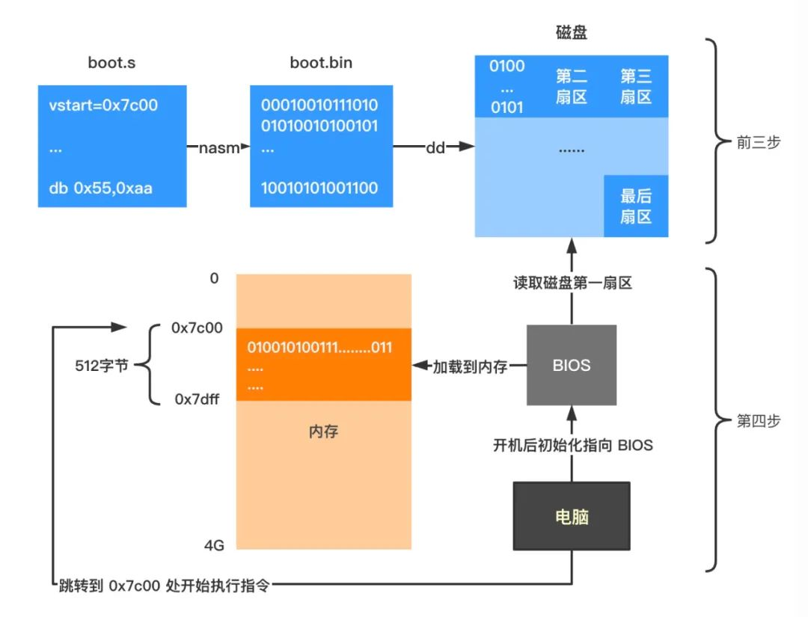

总结起来真是简单得要死，把汇编语言写的 boot.s 文件编译成纯二进制格式的文件 boot.bin，再把这个纯二进制文件写入磁盘（用 bochs 生成的虚拟硬盘文件 os.raw）的第一扇区，最后用 bochs 启动电脑即可。

电脑启动后，BIOS 会把刚刚写入磁盘第一扇区的二进制数据，加载到内存 0x7c00 开始处的后面 512 字节中，然后一个跳转指令跳转到 0x7c00 处开始执行指令。

第一个指令就是由 mov ax, 0xb800 这条汇编指令所编译成的机器码指令，然后不断向后面执行，后面指令的含义就是往显卡映射的内存地址 0xB8000 - 0xB8FFFF 处写数据，显卡便会根据这篇区域的数据，往我们的屏幕上输出一个个小亮点构成的字符，我们就看到了
```s{.line-numbers}
  hello world  
```

#### 尾声
如果你跟到这里，并且可以用各种灵活的方式来实现这个 hello world，那么给自己点个赞吧！

这个 hello world 之所以难，我从我的经历来分析，难在一个理论，一个实践，和一个心理障碍。

理论就是，计算机的启动流程，这就包括了一部分 CPU 硬件，计算机组成原理，以及 BIOS 规范等各种知识，杂糅在了一起，这部分可以通过《全网最硬核解读计算机启动流程》这篇文章梳理。

实践就是，环境搭建，这部分超级头疼，是一座大山。但一旦你熟练之后，它就只是工具而已了。bochs 我用不习惯，换 qemu 也行。windows 用不顺，在 linux 上也行。nasm 看着烦，用其他汇编编译器也可以。总之难的时候是一座无法翻越的大山，简单时就只是工具而已了。这部分我希望你自己去探索，碰几次壁别放弃，就过了这关。

心理障碍就是，总觉得虚拟机和真机不一样。我一开始就老是纠结，这东西在真机上能运行么？以前装系统都用光盘那我这东西能写到光盘里么？人家虚拟机都是 virtual box 那我能不能用 virtual box 启动啊？人家装系统都是 U 盘启动一个 PE 然后选择一个磁盘安装系统，我这个咋和那个有这么大差距呢？请先别纠结这些，就好比你不会加减乘除的时候，问人家那个积分啊微分啊都怎么搞的一样。你得一步步来，先忍住了，相信每一个知识到后面都会用到。等学到后面了，要么是你自己能做出这种工业级的操作系统，要么就是认为那些已经不重要了，你会觉得一开始纠结的时间，真不如先接受着，学下去。

不过，有些宝贵的知识又正是因为走了弯路才拥有的。所以，管他呢~


# 正式启动


